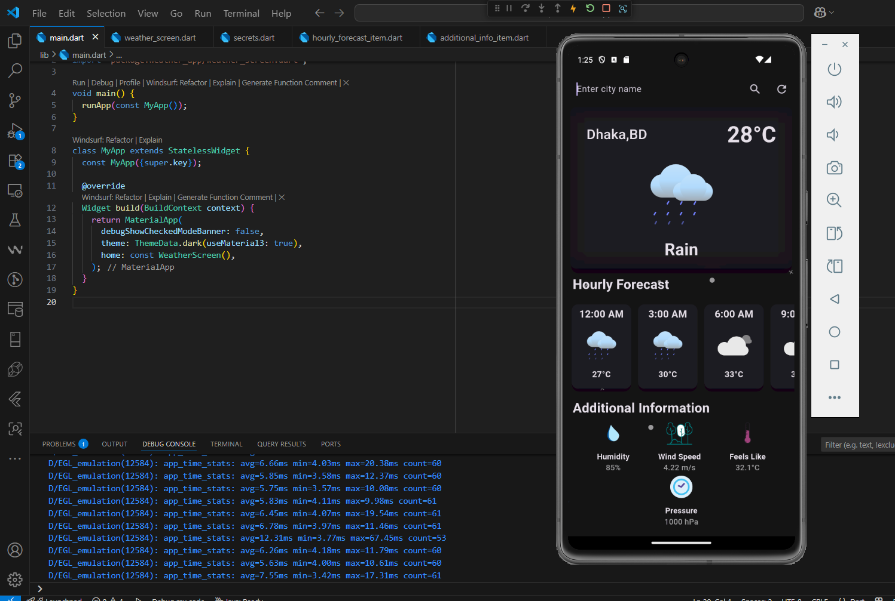
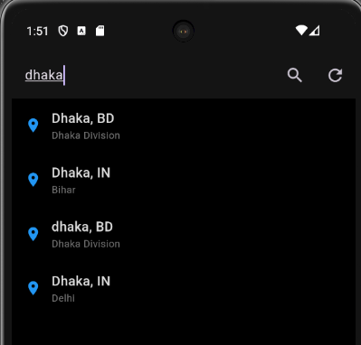

# 🌤 Flutter Weather App

A beautiful, real-time weather app built with Flutter using the OpenWeather API.
It shows current weather, hourly forecast, and additional info with smooth Lottie animations and dynamic backgrounds.

## 🔹 Features

- Search for any city worldwide
- Real-time weather updates (temperature, humidity, wind speed, pressure, etc.)
- Hourly forecast for the next 6 hours
- Lottie animations based on weather conditions (rain, sun, clouds, thunderstorm)
- Dynamic background changes every hour
- Modern, clean UI design

## 🔹 Screenshots
| Weather Interface | Search | Showcase |
|------------|---------|----------|
|  |  |  |

*Tip: Capture these using an emulator or physical device.*

## 🔹 Getting Started

### Prerequisites

- Flutter SDK installed: [Flutter Installation Guide](https://docs.flutter.dev/get-started/install)
- OpenWeather API key: [Get your API key](https://openweathermap.org/api)

### Installation

1. Clone this repository:
```bash
git clone https://github.com/wahid-ski/flutter_weather_app.git
cd flutter_weather_app
```

2. Install dependencies:
```bash
flutter pub get
```

3. Create `lib/secrets.dart` with your API key:
```dart
const String openWeatherAPIKey = "YOUR_API_KEY_HERE";
```

4. Run the app:
```bash
flutter run
```

## 🔹 Project Structure
```
lib/
 ├── main.dart
 ├── weather_screen.dart
 ├── hourly_forecast_item.dart
 ├── additional_info_item.dart
 └── secrets.dart (ignored by git)
assets/
 └── lottie/   # Lottie animation files
pubspec.yaml
```

## 🔹 Future Improvements

- AI-powered weather predictions
- 8-day forecast view
- Dark/light mode toggle
- Custom animations for extreme weather
- Geolocation-based automatic city detection

## 🔹 License

This project is licensed under the MIT License – see [LICENSE](LICENSE) for details.

## 🔹 Contact

Made by **Albari Yasir Wahid** – check my [LinkedIn](https://www.linkedin.com/in/45379328a)
